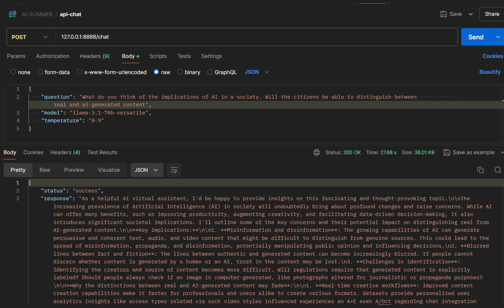

# qua llm

A Q&A chatbot built around open source large language models (including Meta's Llama-3.1-70b, MistralAI's mixtral-8x7b-32768 ).

### Mode of deployment
The chatbot is deployed via a RESTful API. It uses the groq SDK which is a package in Python's library and FastAPI a web framework well suited to building API services. 


### Installation

* Get a copy of the source code of this project into your local repository.

```
git clone https://github.com/KelvinJC/qua-llm.git
```

* The code will be packaged in a directory named qua-llm so change into that directory

```
cd qua-llm
```


### Virtual environment
As a standard practice in Python projects, create and activate your virtual environment.
Run the following commands in your terminal:

* create the virtual environment
```
     python -m venv .venv
```
* activate the virtual environment
```
    # Windows
    source .venv/Scripts/activate

    # Linux
    source .venv/bin/activate
```

### Install dependencies
To install all dependencies from the requirements.txt, run the following command in your terminal:

```
pip install -r requirements.txt
```


### Start usage
To begin chatting with the Chatbot, initialise the server by running the following command

```
python main.py 
```


By default, the api server listens to requests through on port 8888 so once the server is running, 
copy and paste ```http://127.0.0.1:8888/chat``` into your Postman or any API client of your choice.<br>

To prevent clashes on port 8888, make sure no other app is running locally on that port.

Create a POST request specifying the body with three parameters `model`, `query` and `temperature`
- `model`: This parameter is a choice of which model is used to generate answers. There are 3 choices - llama-3.1-70b-versatile, llama-3.1-8b-instant or mixtral-8x7b-32768
- `query`: This is your prompt. The question you wish to ask the chatbot
- `temperature`: This is a parameter you can adjust at will. It dictates how strictly the bot adheres to accuracy. A value closer to 0 enforces that the chatbot generates answers that are as accurate as possible. Values closer to 1, allow the chatbot the freedom to generate answers with greater creative liberty.  

```
{
"model": "llama-3.1-70b-versatile",
"query": "Your query goes here"
"temperature": "Enter a valid number between 0 and 2 here"
}
```
#### Example request



